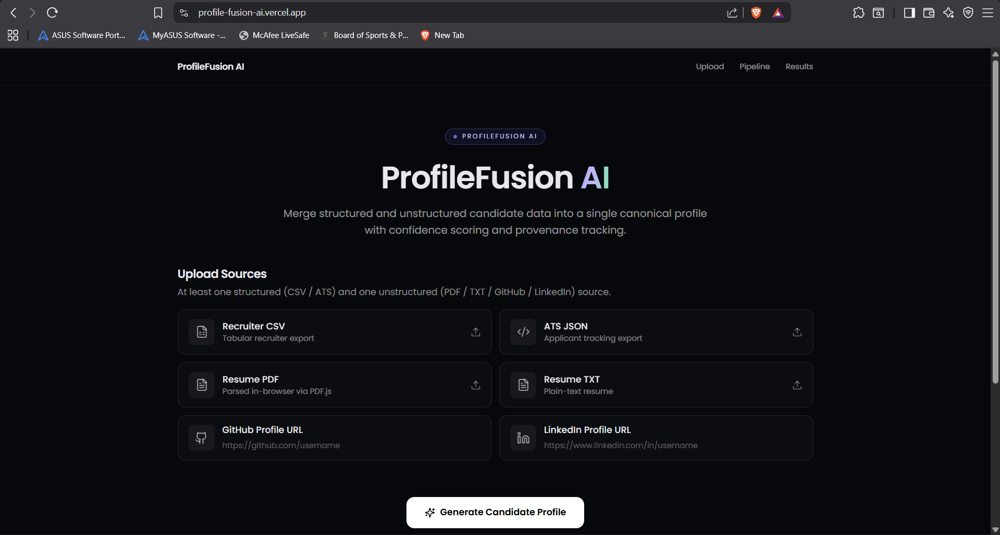
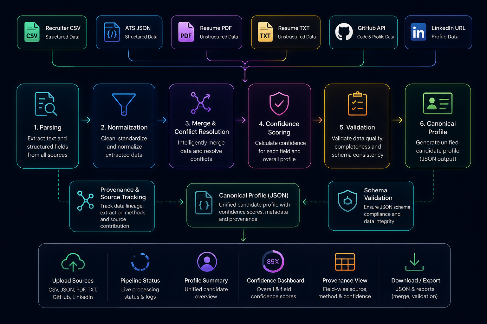

# ProfileFusion AI

> **AI-powered Candidate Data Harmonization Platform**

Transform structured and unstructured candidate data into a single canonical profile using deterministic merging, confidence scoring, provenance tracking, and configurable projection.



🌐 **Live Demo:** https://profile-fusion-ai.vercel.app

---

## Table of Contents

- [Features](#features)
- [System Architecture](#system-architecture)
  - [High Level Architecture](#high-level-architecture)
  - [Pipeline Workflow](#pipeline-workflow)
- [Tech Stack](#tech-stack)
- [Getting Started](#getting-started)
  - [Clone Repository](#clone-repository)
  - [Backend Setup](#backend-setup)
  - [Test with Your Own Data](#test-with-your-own-data)
  - [Frontend Setup](#frontend-setup)
  - [Run CLI](#run-cli)
  - [Run Web UI](#run-web-ui-optional)
- [Output Reports](#output-reports)
- [Project Structure](#project-structure)
- [Design Highlights](#design-highlights)
- [Future Improvements](#future-improvements)
- [Demo Video](#demo-video)
- [License](#license)
- [Contact](#contact)

---

# Features

- 📥 Multi-source candidate ingestion (CSV, ATS JSON, Resume PDF, Resume TXT, GitHub, LinkedIn)
- ⚙️ Automatic parsing of structured and unstructured sources
- 🔄 Deterministic merge engine with configurable source priority
- 🎯 Confidence scoring for every extracted field
- 🧾 Full provenance tracking
- ✅ Schema validation & config-driven projection
- 💻 Interactive React dashboard with pipeline visualization

---

# System Architecture

## High Level Architecture

> Sources → Parsers → Extractors → Normalizers → Merge Engine → Confidence Scoring → Validation → Canonical Profile



## Pipeline Workflow

```text
CSV / ATS / PDF / TXT / GitHub / LinkedIn
                │
                ▼
             Parsers
                │
                ▼
          Field Extraction
                │
                ▼
          Normalization
                │
                ▼
           Merge Engine
                │
                ▼
      Confidence Scoring
                │
                ▼
            Validation
                │
                ▼
        Canonical Profile
                │
                ▼
            JSON Reports
```

---

# Tech Stack

| Layer | Technology |
|-------|------------|
| Frontend | React, Vite, TailwindCSS, Framer Motion |
| Backend | Python |
| Parsing | Pandas, PyMuPDF |
| Validation | Pydantic |
| Testing | Pytest |
| Deployment | Vercel |

---

# Getting Started

## 1. Clone the Repository

```bash

git clone https://github.com/aniket-adhav/ProfileFusion-AI.git

cd ProfileFusion-AI

```

---

## 2. Backend Setup

Navigate to the backend directory and install the required dependencies.

```bash

cd backend

pip install -r requirements.txt

```

---

## 3. Run the CLI

Choose one of the following examples depending on the workflow you want to demonstrate.

All generated reports are written to: backend/output/


### Option A — Complete Pipeline (Recommended)

Processes all local sources, enriches data using GitHub and LinkedIn, and applies the projection configuration.

```bash
python main.py --csv sample_inputs/recruiter.csv --ats sample_inputs/ats.json --pdf sample_inputs/resume.pdf --txt sample_inputs/resume.txt --github https://github.com/aniket-adhav --linkedin https://www.linkedin.com/in/aniket-adhav-a70182312/ --config sample_inputs/config.json
```

---

### Option B — Local Sources Only

Runs the harmonization pipeline using only local structured and unstructured files.

```bash
python main.py --csv sample_inputs/recruiter.csv --ats sample_inputs/ats.json --pdf sample_inputs/resume.pdf --txt sample_inputs/resume.txt
```

---

### Option C — Minimal Demonstration

Uses one structured source and one unstructured source.

```bash
python main.py --csv sample_inputs/recruiter.csv --pdf sample_inputs/resume.pdf
```

> **CLI Requirement**
>
> At least **one structured source** (`CSV` or `ATS JSON`) **and** one **unstructured source** (`PDF`, `TXT`, `GitHub`, or `LinkedIn`) must be provided. Otherwise, the CLI exits with an error.

---

---

## Test with Your Own Data

To evaluate the pipeline with your own candidate information:

1. Replace the files inside:

```text
backend/sample_inputs/
```

with your own:

- `recruiter.csv`
- `ats.json`
- `resume.pdf`
- `resume.txt`

2. (Optional) Replace the GitHub and LinkedIn URLs in the CLI command with the candidate's public profiles.

3. Run any of the CLI commands above.

The generated reports will be available in:

```text
backend/output/
```

---


## 4. Frontend Setup

Open a **new terminal** and navigate to the frontend directory.

```bash
cd ProfileFusion-AI
cd frontend
npm install
```

---

## 5. Run the Web Dashboard

```bash
npm run dev
```

Open your browser and visit:

```text
http://localhost:8080
```

Or explore the deployed version:

🌐 **Live Demo:** https://profile-fusion-ai.vercel.app

> **Note:** The frontend and backend are designed as independent applications. The web dashboard provides an interactive interface for the harmonization pipeline, while the CLI can be executed independently from the `backend` directory. The deployed demo showcases the frontend experience without requiring any local backend setup.

---

## 6. Expected Output

After a successful execution, the following files are generated inside:

```text
backend/output/
```

```text
profile.json
merge_report.json
validation_report.json
projection.json
projection_report.json
```

---

# Project Structure

```text
ProfileFusion-AI
├── assets
├── backend
│   ├── parsers
│   ├── extractors
│   ├── normalizers
│   ├── merger
│   ├── projection
│   ├── validation
│   ├── services
│   ├── sample_inputs
│   ├── output
│   ├── tests
│   ├── app.py
│   └── main.py
├── frontend
│   ├── src
│   ├── package.json
│   └── vite.config.js
└── README.md
```

---

# Design Highlights

- Deterministic merge engine
- Confidence-aware profile generation
- Config-driven projection
- Complete provenance tracking
- Modular architecture
- Responsive React UI

---

# Future Improvements

- AI-assisted conflict resolution
- OCR support for scanned resumes
- Batch profile harmonization
- Additional data connectors
- Cloud-native deployment

---

# Demo Video

🎥 **Coming Soon**

A complete walkthrough demonstrating:

- Web Dashboard
- CLI Execution
- Candidate Harmonization Pipeline
- Generated Reports
- End-to-End Workflow

> Replace this section later with your GitHub video or YouTube link.

---

# License

Licensed under the MIT License.

---

# Contact

**Aniket Adhav**

- GitHub: https://github.com/aniket-adhav
- LinkedIn: https://www.linkedin.com/in/aniket-adhav-a70182312/
- Email: aniketadhav2006@gmail.com
